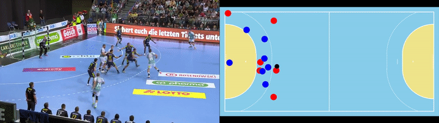

# A Unified Taxonomy and Multimodal Dataset for Events in Invasion Games

<div align="center">    

[](https://dl.acm.org/doi/abs/10.1145/3475722.3482792)
[](https://arxiv.org/abs/2108.11149)
</div>

Official repository for the paper:
>Biermann, H., Theiner, J., Bassek, M., Raabe, D., Memmert, D., & Ewerth, R. (2021, October). A Unified Taxonomy and Multimodal Dataset for Events in Invasion Games. In Proceedings of the 4th International Workshop on Multimedia Content Analysis in Sports (pp. 1-10).

## Contents

- [Events in Invasion Games Dataset - Handball (EIGD-H)](#events-in-invasion-games-dataset---handball--eigd-h-)
  * [Data Source & Characteristics](#data-source---characteristics)
  * [License](#license)
  * [Download](#download)
  * [Visualization Positional Data](#visualization-positional-data)
- [Events in Invasion Games Dataset - Soccer (EIGD-S)](#events-in-invasion-games-dataset---soccer--eigd-s-)
- [Human Performance Evaluation](#human-performance-evaluation)
- [Annotation Guidelines and Event Definitions](#annotation-guidelines-and-event-definitions)
- [Citation](#citation)


***

## Events in Invasion Games Dataset - Handball (EIGD-H)

This dataset contains the broadcast video streams of handball matches along with synchronized official positional data and human event annotations for 125min raw data in summary.

<br>
<div align="center">
  
</div>  

### Data Source & Characteristics


- Handball matches from the [Handball-Bundesliga (HBL)](https://www.liquimoly-hbl.de/en/) captured in saison 2019/20
- Size: 5 matches x 5 sequences x 5min
- Video:
    - unedited broadcast video stream (no cuts, no overlays)
    - HD resolution (1280x720px)@30fps
- Positional data:
    - official captured by [Kinexon](https://kinexon.com/)
    - manually synchronized to video streams (offsets and sampling rate (originally captured at 20Hz))
- Events:
    - frame-wise annotations based solely on the video content
    - annotations according to the proposed taxonomy
    - multiple annotations for two matches (10 sequences) from 3 experts
    - hierarchical event format: `<root_event>.<sub_event>.<sub_sub_event>`
    - statistics: [event_statistics.ipynb]

### License

Position and video data are provided by [Kinexon](https://kinexon.com/) with authorization of the [Handball-Bundesliga (HBL)](https://www.liquimoly-hbl.de/en/).
As *EIGD-H* is licensed under [CC BY-NC-SA 4.0](https://creativecommons.org/licenses/by-nc-sa/4.0/) you must give appropriate credit when using this dataset by
1) naming the *Handball-Bundesliga (HBL)*
2) [citing this publication](#citation)


### Download

You can download the annotations, position and video data manually at https://data.uni-hannover.de/dataset/eigd or automatically using [download_eigd.sh](download_eigd.sh):

### Visualization Positional Data

See [visualize_positional_data.ipynb](visualize_positional_data.ipynb)

## Events in Invasion Games Dataset - Soccer (EIGD-S)

Annotations and URLs to the videos are available at https://data.uni-hannover.de/dataset/eigd . 

- Videos are captured from the official [FIFA *youtube* channel](https://www.youtube.com/channel/UCpcTrCXblq78GZrTUTLWeBw)
- Size: 5 matches x 5 sequences x 5min
- Video:
    - edited broadcast video stream
    - HD resolution (1280x720px)@25fps
- Events: 
    - frame-wise annotations based solely on the video content
    - annotations according to the proposed taxonomy
    - multiple annotations for two matches (10 sequences) from 4 experts and one inexperienced annotator
    - hierarchical event format: `<root_event>.<sub_event>.<sub_sub_event>`


## Human Performance Evaluation

To measure the aggreement of multiple annotators, i.e. the expected human performance, you can use these two notebooks ([evaluate_eigd-h.ipynb](evaluate_eigd-h.ipynb) and [evaluate_eigd-s.ipynb](evaluate_eigd-s.ipynb)) to reproduce the results of the paper.
The formatted output is also accessbile [here](https://data.uni-hannover.de/dataset/eigd/resource/945d1c8c-232e-4356-88f0-6e82abaf3894).


## Annotation Guidelines and Event Definitions

See [definitions.md](data/annotation_guidelines/definitions.md) and [examples.md](data/annotation_guidelines/examples.md).

## Citation
```BibTeX
@inproceedings{BiermannTaxonomyMMSports21,
author = {Biermann, Henrik and Theiner, Jonas and Bassek, Manuel and Raabe, Dominik and Memmert, Daniel and Ewerth, Ralph},
title = {A Unified Taxonomy and Multimodal Dataset for Events in Invasion Games},
year = {2021},
isbn = {9781450386708},
publisher = {Association for Computing Machinery},
address = {New York, NY, USA},
url = {https://doi.org/10.1145/3475722.3482792},
doi = {10.1145/3475722.3482792},
booktitle = {Proceedings of the 4th International Workshop on Multimedia Content Analysis in Sports},
pages = {1–10},
numpages = {10},
keywords = {event detection, human performance analysis, datasets, events in sports},
location = {Virtual Event, China},
series = {MMSports'21}
}
```
